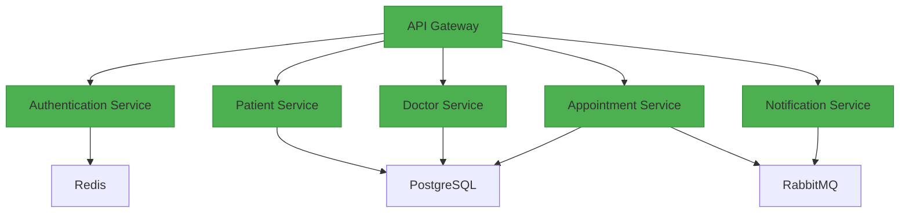

# System Architecture

## Microservices Diagram

## Component Breakdown

1. **API Gateway (FastAPI)**
   - Routes incoming requests
   - Handles rate limiting
   - Manages JWT validation

2. **Authentication Service**
   - OAuth2 password flow
   - JWT token generation
   - Redis session storage

3. **Patient Service**
   - Patient CRUD operations
   - Insurance data management
   - Medical records storage

4. **Doctor Service**
   - Doctor profile management
   - Availability scheduling
   - Specialization tracking

5. **Appointment Service**
   - Conflict detection system
   - Calendar integration
   - Status transitions

6. **Notification Service**
   - Email/SMS notifications
   - RabbitMQ message processing
   - Template management

## Data Flow
1. Client → API Gateway → Service
2. Services ↔ PostgreSQL (ACID transactions)
3. Cross-service communication via RabbitMQ
4. Redis cache for frequent queries

See `API_EXAMPLES.http` for request examples.
